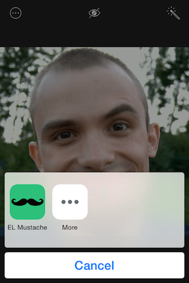

EL Mustache
===========

EL Mustache is an example iOS 8 Photo Editing Extension that adds mustaches to your face. Written completely in Swift.

 .
 

 .
 

More info: [http://blog.elpassion.com/el-mustache/](http://blog.elpassion.com/el-mustache/)
